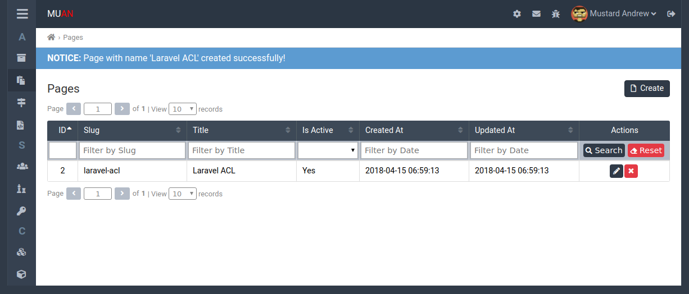

# Maun Laravel Admin package

[](https://codeclimate.com/github/mustardandrew/muan-laravel-admin/maintainability)

Maun Laravel Admin package is a PHP package for Laravel Framework. Used for manipulation data and models.



## Requirements

- "php": ">=7.1"
- "muan/laravel-acl": "^1.1"
- "muan/laravel-comments": "^0.1.0"
- "muan/laravel-tags": "^0.1.0"
- "intervention/image": "^2.4"

## Install

1) Type next command in your terminal:

```bash
composer require muan/laravel-admin
```

2) Add the service provider to your config/app.php file in section providers:

> Laravel 5.5 uses Package Auto-Discovery, so does not require you to manually add the ServiceProvider.

```php
'providers' => [
    // ...
    Muan\Admin\Providers\AdminServiceProvider::class,
    // ...
],
```

3) Use the following trait on your User model

```php
// Use traits
use Muan\Acl\Traits\{HasPermissionsTrait, HasRolesTrait};
use Muan\Admin\Models\Traits\AdminExtendUser;
use Muan\Comments\Traits\CanComment;
 
class User extends Authenticatable
{
    use HasPermissionsTrait, HasRolesTrait, AdminExtendUser, CanComment;
    
    /**
     * Attach base role
     */
    public $baseRole = 'user';
    
    // ...
}
```

4) Start command for installation:

```bash
php artisan admin:install
```


## Commands

Publishing views:
```bash
php artisan vendor:publish --provider="Muan\Admin\Providers\AdminServiceProvider" --tag=admin
```

Add new user:

```bash
php artisan user:add
```

## License

Muan Laravel Admin package is licensed under the [MIT License](http://opensource.org/licenses/MIT).
